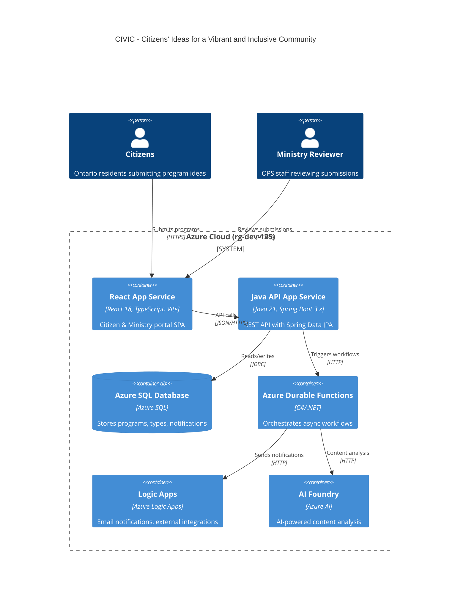
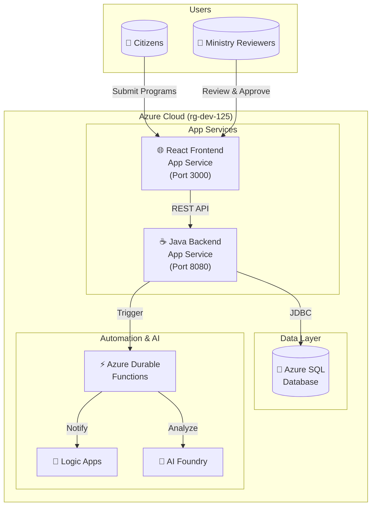
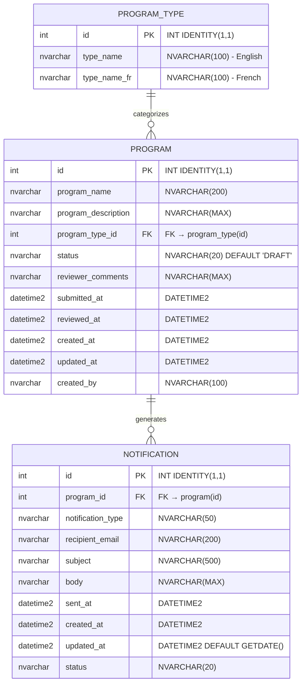

# Documentation Specifications Research for CIVIC Demo

**Status**: Complete  
**Date**: 2026-03-03  
**Research Topic**: Documentation Specifications for CIVIC Demo

---

## Research Topics and Questions

### Primary Topics
1. Complete Mermaid C4/flowchart diagram syntax for architecture documentation
2. Mermaid ER diagram syntax for data dictionary with Azure SQL types
3. API endpoint specifications with TypeScript and Java DTO definitions
4. Frontend component hierarchy with props and accessibility requirements
5. WCAG 2.2, bilingual, and Ontario Design System compliance requirements

### Questions Answered
- [x] What is the correct Mermaid syntax for C4 architecture diagrams?
- [x] How to represent Azure services in Mermaid flowcharts?
- [x] What is the Mermaid ER diagram syntax for Azure SQL data types?
- [x] What are RFC 7807 ProblemDetail specifications for error handling?
- [x] What are the React 18 + TypeScript component patterns for government apps?
- [x] What are WCAG 2.2 accessibility requirements for forms and navigation?
- [x] What Ontario Design System components apply to this application?

---

## Key Specifications

### 1. Architecture Diagram (`docs/architecture.md`)

#### Complete Mermaid C4 Container Diagram Syntax



#### Alternative Flowchart Syntax (Simpler)



#### Architecture Document Structure

```markdown
# CIVIC Architecture

## Overview
Citizens' Ideas for a Vibrant and Inclusive Community (CIVIC) is a full-stack 
web application enabling Ontario citizens to submit program ideas and ministry 
staff to review and approve them.

## System Context
- **Users**: Citizens (submit), Ministry Reviewers (approve/reject)
- **Frontend**: React 18 SPA on Azure App Service
- **Backend**: Java 21 Spring Boot API on Azure App Service  
- **Database**: Azure SQL with H2 compatibility for local dev

## Container Diagram
[Mermaid C4Container diagram here]

## Technology Stack
| Layer | Technology | Version | Purpose |
|-------|------------|---------|---------|
| Frontend | React + TypeScript | 18.x | Single Page Application |
| Build | Vite | 5.x | Fast dev server (port 3000) |
| Backend | Spring Boot | 3.x | REST API |
| ORM | Spring Data JPA | 3.x | Database access |
| Database | Azure SQL / H2 | - | Persistent storage |
| Runtime | Java | 21 LTS | Backend runtime |

## Azure Resources (rg-dev-125)
- 2x App Services (frontend, backend)
- Azure SQL Database
- Azure Durable Functions
- Logic Apps (notifications)
- AI Foundry (content analysis)

## Compliance
- **Accessibility**: WCAG 2.2 Level AA
- **Bilingual**: English/French (i18next)
- **Design**: Ontario Design System
```

---

### 2. Data Dictionary (`docs/data-dictionary.md`)

#### Complete Mermaid ER Diagram Syntax



#### Table Specifications

##### Table: `program_type` (Reference Data)
| Column | Type | Constraints | Description |
|--------|------|-------------|-------------|
| `id` | `INT` | `PRIMARY KEY IDENTITY(1,1)` | Auto-increment ID |
| `type_name` | `NVARCHAR(100)` | `NOT NULL` | English name |
| `type_name_fr` | `NVARCHAR(100)` | `NOT NULL` | French name |

**Note**: No audit columns - static reference data.

##### Table: `program` (Main Entity)
| Column | Type | Constraints | Description |
|--------|------|-------------|-------------|
| `id` | `INT` | `PRIMARY KEY IDENTITY(1,1)` | Auto-increment ID |
| `program_name` | `NVARCHAR(200)` | `NOT NULL` | Program title |
| `program_description` | `NVARCHAR(MAX)` | - | Full description |
| `program_type_id` | `INT` | `FOREIGN KEY → program_type(id)` | Category reference |
| `status` | `NVARCHAR(20)` | `DEFAULT 'DRAFT'` | DRAFT/SUBMITTED/APPROVED/REJECTED |
| `reviewer_comments` | `NVARCHAR(MAX)` | - | Ministry feedback |
| `submitted_at` | `DATETIME2` | - | Submission timestamp |
| `reviewed_at` | `DATETIME2` | - | Review timestamp |
| `created_at` | `DATETIME2` | `NOT NULL` | Record creation |
| `updated_at` | `DATETIME2` | - | Last modification |
| `created_by` | `NVARCHAR(100)` | - | Submitter identifier |

##### Table: `notification` (Audit/History)
| Column | Type | Constraints | Description |
|--------|------|-------------|-------------|
| `id` | `INT` | `PRIMARY KEY IDENTITY(1,1)` | Auto-increment ID |
| `program_id` | `INT` | `FOREIGN KEY → program(id)` | Related program |
| `notification_type` | `NVARCHAR(50)` | - | SUBMISSION/APPROVAL/REJECTION |
| `recipient_email` | `NVARCHAR(200)` | - | Email address |
| `subject` | `NVARCHAR(500)` | - | Email subject |
| `body` | `NVARCHAR(MAX)` | - | Email body |
| `sent_at` | `DATETIME2` | - | Send timestamp |
| `created_at` | `DATETIME2` | `NOT NULL` | Record creation |
| `updated_at` | `DATETIME2` | `DEFAULT GETDATE()` | Last modification |
| `status` | `NVARCHAR(20)` | - | PENDING/SENT/FAILED |

#### Seed Data (5 Program Types - Bilingual EN/FR)

```sql
-- Using INSERT ... WHERE NOT EXISTS pattern (Azure SQL & H2 compatible)
INSERT INTO program_type (type_name, type_name_fr)
SELECT 'Community Services', 'Services communautaires'
WHERE NOT EXISTS (SELECT 1 FROM program_type WHERE type_name = 'Community Services');

INSERT INTO program_type (type_name, type_name_fr)
SELECT 'Health & Wellness', 'Santé et bien-être'
WHERE NOT EXISTS (SELECT 1 FROM program_type WHERE type_name = 'Health & Wellness');

INSERT INTO program_type (type_name, type_name_fr)
SELECT 'Education & Training', 'Éducation et formation'
WHERE NOT EXISTS (SELECT 1 FROM program_type WHERE type_name = 'Education & Training');

INSERT INTO program_type (type_name, type_name_fr)
SELECT 'Environment & Conservation', 'Environnement et conservation'
WHERE NOT EXISTS (SELECT 1 FROM program_type WHERE type_name = 'Environment & Conservation');

INSERT INTO program_type (type_name, type_name_fr)
SELECT 'Economic Development', 'Développement économique'
WHERE NOT EXISTS (SELECT 1 FROM program_type WHERE type_name = 'Economic Development');
```

| ID | English Name | French Name |
|----|--------------|-------------|
| 1 | Community Services | Services communautaires |
| 2 | Health & Wellness | Santé et bien-être |
| 3 | Education & Training | Éducation et formation |
| 4 | Environment & Conservation | Environnement et conservation |
| 5 | Economic Development | Développement économique |

---

### 3. Design Document (`docs/design-document.md`)

#### API Endpoints Specification (5 Endpoints)

##### Endpoint 1: `POST /api/programs` - Submit Program

**Request DTO (TypeScript)**:
```typescript
interface CreateProgramRequest {
  programName: string;        // Required, max 200 chars
  programDescription: string; // Required
  programTypeId: number;      // Required, FK to program_type
  createdBy?: string;         // Optional, max 100 chars
}
```

**Request DTO (Java)**:
```java
public record CreateProgramRequest(
    @NotBlank @Size(max = 200) String programName,
    @NotBlank String programDescription,
    @NotNull Integer programTypeId,
    @Size(max = 100) String createdBy
) {}
```

**Response DTO**:
```typescript
interface ProgramResponse {
  id: number;
  programName: string;
  programDescription: string;
  programType: ProgramTypeResponse;
  status: 'DRAFT' | 'SUBMITTED' | 'APPROVED' | 'REJECTED';
  reviewerComments: string | null;
  submittedAt: string | null;  // ISO 8601
  reviewedAt: string | null;   // ISO 8601
  createdAt: string;           // ISO 8601
  updatedAt: string | null;    // ISO 8601
  createdBy: string | null;
}

interface ProgramTypeResponse {
  id: number;
  typeName: string;
  typeNameFr: string;
}
```

**Java Response**:
```java
public record ProgramResponse(
    Long id,
    String programName,
    String programDescription,
    ProgramTypeResponse programType,
    String status,
    String reviewerComments,
    Instant submittedAt,
    Instant reviewedAt,
    Instant createdAt,
    Instant updatedAt,
    String createdBy
) {}
```

**Validation Rules**:
- `programName`: Required, 1-200 characters
- `programDescription`: Required, non-empty
- `programTypeId`: Required, must exist in `program_type`

**HTTP Responses**:
| Status | Description |
|--------|-------------|
| `201 Created` | Program created successfully |
| `400 Bad Request` | Validation failed (ProblemDetail) |
| `500 Internal Server Error` | Server error (ProblemDetail) |

---

##### Endpoint 2: `GET /api/programs` - List Programs

**Query Parameters**:
| Parameter | Type | Default | Description |
|-----------|------|---------|-------------|
| `status` | `string` | - | Filter by status |
| `page` | `number` | `0` | Page number (0-indexed) |
| `size` | `number` | `20` | Page size |

**Response**:
```typescript
interface PagedResponse<T> {
  content: T[];
  totalElements: number;
  totalPages: number;
  number: number;  // Current page
  size: number;
  first: boolean;
  last: boolean;
}
```

---

##### Endpoint 3: `GET /api/programs/{id}` - Get Program by ID

**Path Parameters**:
| Parameter | Type | Description |
|-----------|------|-------------|
| `id` | `number` | Program ID |

**HTTP Responses**:
| Status | Description |
|--------|-------------|
| `200 OK` | Program found |
| `404 Not Found` | Program not found (ProblemDetail) |

---

##### Endpoint 4: `PUT /api/programs/{id}/review` - Approve/Reject Program

**Request DTO**:
```typescript
interface ReviewProgramRequest {
  action: 'APPROVE' | 'REJECT';
  reviewerComments?: string;  // Required for REJECT
}
```

**Java Request**:
```java
public record ReviewProgramRequest(
    @NotNull ReviewAction action,
    String reviewerComments
) {
    public enum ReviewAction { APPROVE, REJECT }
}
```

**Validation Rules**:
- `action`: Required, must be APPROVE or REJECT
- `reviewerComments`: Required when action is REJECT

**HTTP Responses**:
| Status | Description |
|--------|-------------|
| `200 OK` | Review completed |
| `400 Bad Request` | Invalid review (ProblemDetail) |
| `404 Not Found` | Program not found (ProblemDetail) |

---

##### Endpoint 5: `GET /api/program-types` - List Program Types

**Response**:
```typescript
interface ProgramTypeResponse {
  id: number;
  typeName: string;      // English
  typeNameFr: string;    // French
}

// Returns: ProgramTypeResponse[]
```

---

#### RFC 7807 ProblemDetail Error Handling

**Error Response Format** (`application/problem+json`):

```typescript
interface ProblemDetail {
  type: string;           // URI identifying problem type
  title: string;          // Human-readable summary
  status: number;         // HTTP status code
  detail?: string;        // Human-readable explanation
  instance?: string;      // URI identifying occurrence
  // Extension fields
  timestamp?: string;     // ISO 8601
  errors?: ValidationError[];
}

interface ValidationError {
  field: string;
  message: string;
  rejected?: unknown;
}
```

**Java Implementation**:
```java
@RestControllerAdvice
public class GlobalExceptionHandler {
    
    @ExceptionHandler(MethodArgumentNotValidException.class)
    public ProblemDetail handleValidation(MethodArgumentNotValidException ex) {
        ProblemDetail problem = ProblemDetail.forStatus(HttpStatus.BAD_REQUEST);
        problem.setType(URI.create("https://civic.ontario.ca/errors/validation"));
        problem.setTitle("Validation Failed");
        problem.setProperty("errors", ex.getBindingResult().getFieldErrors()
            .stream()
            .map(e -> Map.of(
                "field", e.getField(),
                "message", e.getDefaultMessage(),
                "rejected", e.getRejectedValue()
            ))
            .toList());
        return problem;
    }

    @ExceptionHandler(ProgramNotFoundException.class)
    public ProblemDetail handleNotFound(ProgramNotFoundException ex) {
        ProblemDetail problem = ProblemDetail.forStatus(HttpStatus.NOT_FOUND);
        problem.setType(URI.create("https://civic.ontario.ca/errors/not-found"));
        problem.setTitle("Program Not Found");
        problem.setDetail(ex.getMessage());
        return problem;
    }
}
```

**Example Error Response (400)**:
```json
{
  "type": "https://civic.ontario.ca/errors/validation",
  "title": "Validation Failed",
  "status": 400,
  "detail": "Request validation failed",
  "instance": "/api/programs",
  "timestamp": "2026-03-03T10:30:00Z",
  "errors": [
    {
      "field": "programName",
      "message": "must not be blank",
      "rejected": null
    }
  ]
}
```

---

#### Frontend Component Hierarchy

```
App
├── BrowserRouter
│   ├── Layout
│   │   ├── Header
│   │   │   ├── Logo (Ontario DS)
│   │   │   ├── Navigation
│   │   │   └── LanguageToggle
│   │   │       └── useTranslation (i18next)
│   │   ├── main
│   │   │   └── Outlet (react-router)
│   │   └── Footer
│   │       └── FooterLinks
│   │
│   └── Routes
│       ├── "/" → SubmitProgram
│       │   ├── ProgramForm
│       │   │   ├── Input (programName)
│       │   │   ├── Textarea (programDescription)
│       │   │   ├── Select (programTypeId)
│       │   │   └── Button (submit)
│       │   └── useCreateProgram (mutation hook)
│       │
│       ├── "/confirmation/:id" → SubmitConfirmation
│       │   ├── SuccessMessage
│       │   └── ProgramSummary
│       │
│       ├── "/search" → SearchPrograms
│       │   ├── SearchFilters
│       │   │   ├── StatusFilter
│       │   │   └── TypeFilter
│       │   ├── ProgramList
│       │   │   └── ProgramCard[]
│       │   └── Pagination
│       │
│       ├── "/review" → ReviewDashboard
│       │   ├── StatusTabs (SUBMITTED, APPROVED, REJECTED)
│       │   └── ProgramTable
│       │       └── ProgramRow[]
│       │
│       └── "/review/:id" → ReviewDetail
│           ├── ProgramDetails
│           ├── ReviewForm
│           │   ├── RadioGroup (APPROVE/REJECT)
│           │   ├── Textarea (reviewerComments)
│           │   └── Button (submitReview)
│           └── useReviewProgram (mutation hook)
```

#### Component Props Specifications

```typescript
// Layout Components
interface HeaderProps {
  title?: string;
}

interface LanguageToggleProps {
  onLanguageChange?: (lang: 'en' | 'fr') => void;
}

interface FooterProps {
  links?: FooterLink[];
}

// Form Components
interface ProgramFormProps {
  onSubmit: (data: CreateProgramRequest) => void;
  isLoading?: boolean;
  programTypes: ProgramTypeResponse[];
}

interface ReviewFormProps {
  programId: number;
  onSubmit: (data: ReviewProgramRequest) => void;
  isLoading?: boolean;
}

// Display Components
interface ProgramCardProps {
  program: ProgramResponse;
  onClick?: (id: number) => void;
}

interface ProgramTableProps {
  programs: ProgramResponse[];
  onRowClick?: (id: number) => void;
}

interface PaginationProps {
  currentPage: number;
  totalPages: number;
  onPageChange: (page: number) => void;
}

// Filter Components
interface StatusFilterProps {
  value: string | null;
  onChange: (status: string | null) => void;
  options: Array<{ value: string; label: string }>;
}
```

---

### 4. Compliance Requirements

#### WCAG 2.2 Level AA Requirements

| Criterion | Requirement | Implementation |
|-----------|-------------|----------------|
| 1.1.1 Non-text Content | Alt text for images | `alt` attributes on all images |
| 1.3.1 Info & Relationships | Semantic structure | Use `<header>`, `<main>`, `<nav>`, `<article>` |
| 1.4.3 Contrast | 4.5:1 minimum | Ontario DS colors meet this |
| 2.1.1 Keyboard | All functionality via keyboard | Tab navigation, Enter/Space activation |
| 2.4.1 Bypass Blocks | Skip navigation | "Skip to main content" link |
| 2.4.2 Page Titled | Descriptive titles | Dynamic page titles via react-helmet |
| 2.4.7 Focus Visible | Visible focus indicator | `:focus-visible` styles |
| 3.3.1 Error Identification | Identify errors | Field-level error messages |
| 3.3.2 Labels | Labels for inputs | `<label>` elements with `htmlFor` |
| 4.1.2 Name, Role, Value | ARIA for custom widgets | `aria-*` attributes |

#### Accessibility Implementation

```tsx
// Required HTML lang attribute
<html lang={i18n.language}>

// Skip link
<a href="#main-content" className="skip-link">
  {t('accessibility.skipToContent')}
</a>

// Form field with proper labeling
<div className="ontario-form-group">
  <label htmlFor="programName" className="ontario-label">
    {t('form.programName')} <span className="ontario-label__flag">(required)</span>
  </label>
  <input
    id="programName"
    type="text"
    className="ontario-input"
    aria-required="true"
    aria-invalid={!!errors.programName}
    aria-describedby={errors.programName ? "programName-error" : undefined}
  />
  {errors.programName && (
    <span id="programName-error" className="ontario-error-message" role="alert">
      {errors.programName.message}
    </span>
  )}
</div>
```

#### Ontario Design System Components

- `ontario-header` - Provincial header with logo
- `ontario-footer` - Provincial footer with links
- `ontario-button` - Primary/secondary buttons
- `ontario-input` - Text input fields
- `ontario-textarea` - Multi-line text
- `ontario-select` - Dropdown menus
- `ontario-hint` - Help text
- `ontario-error-message` - Error display
- `ontario-table` - Data tables
- `ontario-callout` - Information callouts

#### Bilingual (EN/FR) Implementation

```typescript
// i18next configuration
import i18n from 'i18next';
import { initReactI18next } from 'react-i18next';

i18n.use(initReactI18next).init({
  resources: {
    en: { translation: require('./locales/en.json') },
    fr: { translation: require('./locales/fr.json') }
  },
  lng: 'en',
  fallbackLng: 'en',
  interpolation: { escapeValue: false }
});

// Usage in components
const { t, i18n } = useTranslation();

// Display bilingual content from API
const displayType = i18n.language === 'fr' 
  ? programType.typeNameFr 
  : programType.typeName;
```

---

## References and Evidence

### Mermaid Documentation
- **ER Diagrams**: https://mermaid.js.org/syntax/entityRelationshipDiagram.html
  - Relationship syntax: `||--o{` (one-to-many), `||--|{` (one-to-one-or-more)
  - Attribute syntax: `type name PK/FK "comment"`
  - Direction: `direction LR` or `direction TB`
  
- **C4 Diagrams**: https://mermaid.js.org/syntax/c4.html
  - Types: C4Context, C4Container, C4Component, C4Dynamic, C4Deployment
  - Elements: Person, System, Container, ContainerDb, Boundary
  - Relationships: Rel, BiRel, Rel_L, Rel_R, Rel_U, Rel_D

### RFC 7807 ProblemDetail
- **Specification**: https://datatracker.ietf.org/doc/html/rfc7807
- **Media Type**: `application/problem+json`
- **Required Members**: `type`, `title`, `status`
- **Optional Members**: `detail`, `instance`
- **Extension Members**: Custom fields allowed

### Spring Boot ProblemDetail
- Native support in Spring Boot 3.x via `ProblemDetail` class
- `@RestControllerAdvice` for global exception handling
- Automatic `Content-Type: application/problem+json` response

### React 18 Patterns
- Functional components with hooks
- `useState`, `useEffect`, `useCallback`, `useMemo`
- React Query or SWR for data fetching
- react-router-dom v6 for routing

### Ontario Design System
- CSS framework aligned with provincial standards
- Accessible by default
- Bilingual support

---

## Discovered Research Topics

During research, the following additional topics were identified:

1. **H2 `MODE=MSSQLServer`**: Required for local development to ensure Azure SQL compatibility
2. **Flyway Migrations**: Version format `V001__description.sql`
3. **INSERT ... WHERE NOT EXISTS**: Portable pattern instead of MERGE
4. **Spring Data JPA Auditing**: `@CreatedDate`, `@LastModifiedDate` annotations
5. **React Helmet**: For dynamic page titles (WCAG 2.4.2)

---

## Next Research Recommendations

### Completed
- [x] Mermaid diagram syntax (C4, ER)
- [x] RFC 7807 ProblemDetail specification
- [x] API endpoint definitions with DTOs
- [x] Frontend component hierarchy
- [x] WCAG 2.2 requirements
- [x] Ontario DS components

### Recommended Follow-Up (Not Required for Current Task)
- [ ] Azure Durable Functions orchestration patterns
- [ ] Logic Apps email connector configuration
- [ ] AI Foundry content moderation capabilities
- [ ] Automated accessibility testing with axe-core
- [ ] CI/CD pipeline configuration for Azure App Services

---

## Clarifying Questions

None - all specifications have been fully documented based on the provided requirements and research findings.

