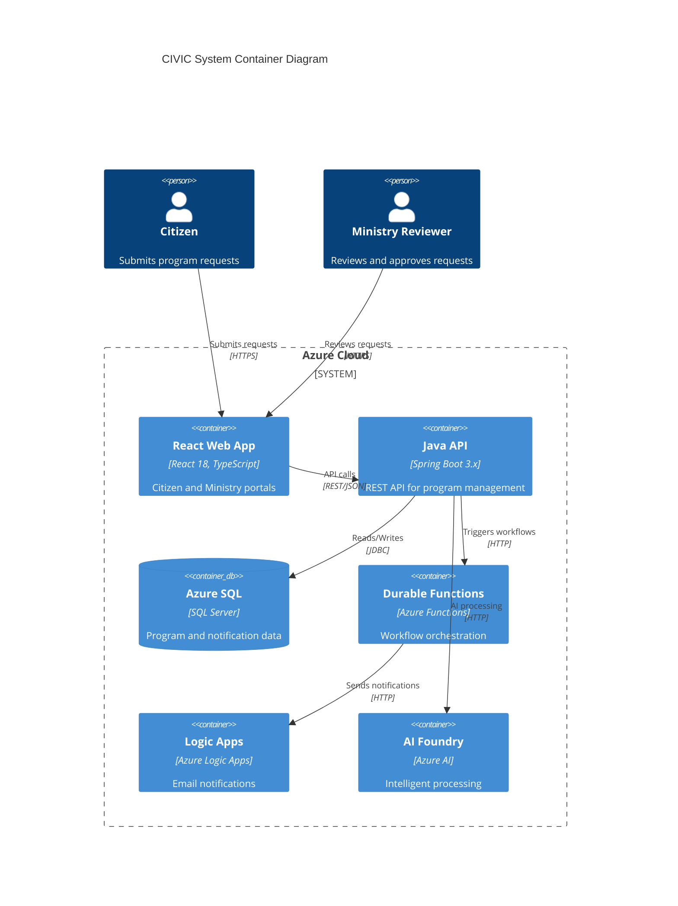

## Overview

The CIVIC Program Request Management System is a bilingual (English/French) web application designed for Ontario Public Sector program request management. Citizens submit program requests through a web portal, and Ministry Reviewers process these requests through a dedicated review dashboard.

## C4 Container Diagram

## Technology Stack

| Component | Technology | Version |
|-----------|------------|---------|
| Frontend | React + TypeScript + Vite | 18.x, 5.x |
| Backend | Java + Spring Boot | 21, 3.x |
| Database | Azure SQL / H2 | - |
| Orchestration | Azure Durable Functions | - |
| Notifications | Azure Logic Apps | - |
| AI | Azure AI Foundry | - |

## Azure Resources

**Resource Group:** `rg-dev-125`

| Resource | Type | Purpose |
|----------|------|---------|
| App Service (Frontend) | Web App | Hosts React SPA |
| App Service (Backend) | Web App | Hosts Spring Boot API |
| Azure SQL Database | Database | Program and notification data storage |
| Function App | Azure Functions | Durable Functions for workflow orchestration |
| Logic App | Azure Logic Apps | Email notification workflows |
| AI Foundry Workspace | Azure AI | Intelligent processing capabilities |

## Data Flow

1. **Citizen Submission:** Citizens access the React frontend via HTTPS and submit program requests
2. **API Processing:** Frontend sends REST/JSON requests to the Spring Boot backend
3. **Data Persistence:** Backend stores program data in Azure SQL via JDBC
4. **Workflow Trigger:** Backend triggers Durable Functions for approval workflows
5. **Notifications:** Durable Functions invoke Logic Apps for email notifications
6. **AI Processing:** Backend leverages AI Foundry for intelligent request processing

## Compliance

| Standard | Requirement | Status |
|----------|-------------|--------|
| WCAG 2.2 | Level AA accessibility | Required |
| Ontario Design System | Government UI standards | Required |
| Bilingual Support | English/French | Required |

## Security Considerations

* HTTPS encryption for all communications
* Azure Active Directory integration for authentication
* Role-based access control (RBAC) for Ministry Reviewers
* Data encryption at rest and in transit
* Audit logging for all program state changes
