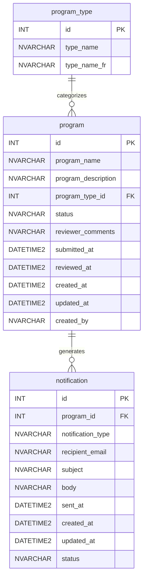

## Overview

This document defines the database schema for the CIVIC Program Request Management System. The system uses Azure SQL Database in production and H2 in-memory database for development.

## Entity Relationship Diagram



## Table Definitions

### Table: program_type

Reference data table containing bilingual program categories.

| Column | Type | Constraints | Description |
|--------|------|-------------|-------------|
| id | INT | PK IDENTITY(1,1) | Unique identifier |
| type_name | NVARCHAR(100) | NOT NULL | English name |
| type_name_fr | NVARCHAR(100) | NOT NULL | French name |

**DDL:**

```sql
CREATE TABLE program_type (
    id INT IDENTITY(1,1) PRIMARY KEY,
    type_name NVARCHAR(100) NOT NULL,
    type_name_fr NVARCHAR(100) NOT NULL
);
```

### Table: program

Main entity table storing program request submissions and their review status.

| Column | Type | Constraints | Description |
|--------|------|-------------|-------------|
| id | INT | PK IDENTITY(1,1) | Unique identifier |
| program_name | NVARCHAR(200) | NOT NULL | Program title |
| program_description | NVARCHAR(MAX) | | Detailed description |
| program_type_id | INT | FK → program_type(id) | Category reference |
| status | NVARCHAR(20) | DEFAULT 'DRAFT' | DRAFT/SUBMITTED/APPROVED/REJECTED |
| reviewer_comments | NVARCHAR(MAX) | | Review feedback |
| submitted_at | DATETIME2 | | Submission timestamp |
| reviewed_at | DATETIME2 | | Review timestamp |
| created_at | DATETIME2 | NOT NULL | Creation timestamp |
| updated_at | DATETIME2 | | Last update timestamp |
| created_by | NVARCHAR(100) | | Submitter identifier |

**Status Values:**

| Status | Description |
|--------|-------------|
| DRAFT | Initial state, not yet submitted |
| SUBMITTED | Awaiting review by Ministry |
| APPROVED | Approved by Ministry Reviewer |
| REJECTED | Rejected by Ministry Reviewer |

**DDL:**

```sql
CREATE TABLE program (
    id INT IDENTITY(1,1) PRIMARY KEY,
    program_name NVARCHAR(200) NOT NULL,
    program_description NVARCHAR(MAX),
    program_type_id INT FOREIGN KEY REFERENCES program_type(id),
    status NVARCHAR(20) DEFAULT 'DRAFT',
    reviewer_comments NVARCHAR(MAX),
    submitted_at DATETIME2,
    reviewed_at DATETIME2,
    created_at DATETIME2 NOT NULL DEFAULT GETDATE(),
    updated_at DATETIME2,
    created_by NVARCHAR(100)
);
```

### Table: notification

Audit and history table tracking all email notifications sent by the system.

| Column | Type | Constraints | Description |
|--------|------|-------------|-------------|
| id | INT | PK IDENTITY(1,1) | Unique identifier |
| program_id | INT | FK → program(id) | Related program |
| notification_type | NVARCHAR(50) | | Type of notification |
| recipient_email | NVARCHAR(200) | | Recipient address |
| subject | NVARCHAR(500) | | Email subject |
| body | NVARCHAR(MAX) | | Email body |
| sent_at | DATETIME2 | | Send timestamp |
| created_at | DATETIME2 | NOT NULL | Creation timestamp |
| updated_at | DATETIME2 | DEFAULT GETDATE() | Last update timestamp |
| status | NVARCHAR(20) | | PENDING/SENT/FAILED |

**Notification Types:**

| Type | Description |
|------|-------------|
| SUBMISSION_CONFIRMATION | Sent to citizen upon submission |
| REVIEW_APPROVAL | Sent when program is approved |
| REVIEW_REJECTION | Sent when program is rejected |
| STATUS_UPDATE | General status change notification |

**DDL:**

```sql
CREATE TABLE notification (
    id INT IDENTITY(1,1) PRIMARY KEY,
    program_id INT FOREIGN KEY REFERENCES program(id),
    notification_type NVARCHAR(50),
    recipient_email NVARCHAR(200),
    subject NVARCHAR(500),
    body NVARCHAR(MAX),
    sent_at DATETIME2,
    created_at DATETIME2 NOT NULL DEFAULT GETDATE(),
    updated_at DATETIME2 DEFAULT GETDATE(),
    status NVARCHAR(20)
);
```

## Seed Data

### Program Types

Bilingual program categories pre-populated in the system.

| id | type_name | type_name_fr |
|----|-----------|--------------|
| 1 | Community Services | Services communautaires |
| 2 | Health & Wellness | Santé et bien-être |
| 3 | Education & Training | Éducation et formation |
| 4 | Environment & Conservation | Environnement et conservation |
| 5 | Economic Development | Développement économique |

**Seed SQL:**

```sql
INSERT INTO program_type (type_name, type_name_fr) VALUES
    ('Community Services', 'Services communautaires'),
    ('Health & Wellness', 'Santé et bien-être'),
    ('Education & Training', 'Éducation et formation'),
    ('Environment & Conservation', 'Environnement et conservation'),
    ('Economic Development', 'Développement économique');
```

## Indexes

Recommended indexes for query optimization:

```sql
-- Improve filtering by status
CREATE INDEX idx_program_status ON program(status);

-- Improve filtering by program type
CREATE INDEX idx_program_type ON program(program_type_id);

-- Improve notification lookup by program
CREATE INDEX idx_notification_program ON notification(program_id);

-- Improve notification filtering by status
CREATE INDEX idx_notification_status ON notification(status);
```

## Constraints Summary

| Table | Constraint | Type | Description |
|-------|------------|------|-------------|
| program_type | PK_program_type | Primary Key | id |
| program | PK_program | Primary Key | id |
| program | FK_program_type | Foreign Key | program_type_id → program_type(id) |
| notification | PK_notification | Primary Key | id |
| notification | FK_notification_program | Foreign Key | program_id → program(id) |
